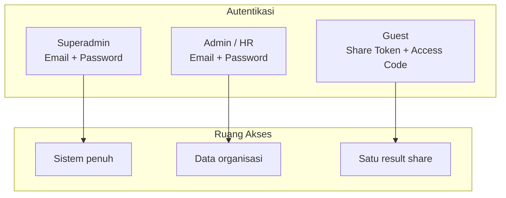
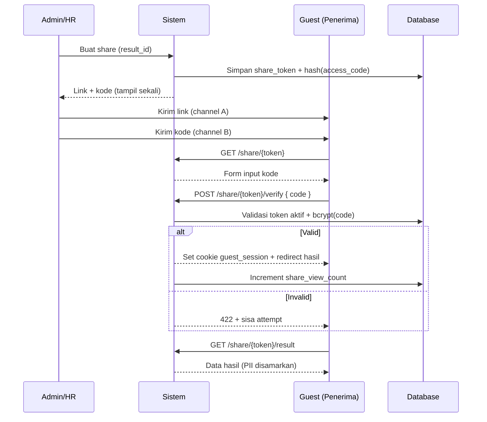

# Role-Based Access Control (RBAC)

**Dokumen:** Spesifikasi role, permission, dan akses platform AI Assessment  
**Versi:** 1.0  
**Terakhir diperbarui:** 25 Mei 2026  
**Status:** Draft  
**Referensi:** `PRD_AIASSESS_V1.md`, `BLADE_APPROACH.md`, `ASSESSMENT.md`

---

## Daftar Isi

1. [Ringkasan](#1-ringkasan)
2. [Prinsip RBAC](#2-prinsip-rbac)
3. [Definisi Role](#3-definisi-role)
4. [Matriks Permission](#4-matriks-permission)
5. [Akses per Modul](#5-akses-per-modul)
6. [Guest: Share Link & Kode Akses](#6-guest-share-link--kode-akses)
7. [Autentikasi & Middleware](#7-autentikasi--middleware)
8. [Skema Data](#8-skema-data)
9. [Keamanan & Rate Limiting](#9-keamanan--rate-limiting)
10. [Implementasi (Spatie Permission)](#10-implementasi-spatie-permission)
11. [Lampiran](#11-lampiran)

---

## 1. Ringkasan

Platform AI Assessment menggunakan **tiga role utama** dengan model akses berbeda:

| Role | Autentikasi | Ruang lingkup data |
|------|-------------|-------------------|
| **Superadmin** | Login (session) | Seluruh tenant/sistem |
| **Admin / HR** | Login (session) | Organisasi/unit kerja yang di-assign |
| **Guest** | Share link + kode akses | Satu hasil assessment yang di-share |



**Catatan:** Role **end-user** (kandidat/pegawai yang mengambil assessment) berada di luar dokumen ini; mereka login sebagai user biasa dan hanya mengakses data milik sendiri. Dokumen ini fokus pada **operator internal** (superadmin, admin/HR) dan **pihak eksternal** (guest via share).

---

## 2. Prinsip RBAC

1. **Least privilege** — Setiap role hanya mendapat permission minimum yang dibutuhkan.
2. **Explicit deny** — Jika permission tidak tercantum, akses ditolak (403).
3. **Scope terpisah** — Superadmin = global; Admin/HR = scoped ke organisasi; Guest = scoped ke satu `assessment_result`.
4. **Guest bukan user terdaftar** — Guest tidak punya akun, tidak bisa login dashboard, dan tidak mengakses API terautentikasi user.
5. **Audit trail** — Semua aksi sensitif (CRUD user, ubah role, revoke share) dicatat di activity log.
6. **Implementasi** — [Spatie Laravel Permission](https://spatie.be/docs/laravel-permission) untuk role & permission; guest di-handle middleware khusus di luar Spatie.

---

## 3. Definisi Role

### 3.1 Superadmin

| Atribut | Nilai |
|---------|-------|
| **Slug role** | `superadmin` |
| **Target pengguna** | Tim engineering, product owner, support level 3 |
| **Jumlah akun** | Sangat terbatas (1–3 akun produksi) |
| **Scope data** | Global — semua user, hasil, invoice, voucher, konfigurasi sistem |

**Tanggung jawab:**

- Manajemen seluruh user termasuk assign/revoke role admin & HR
- Konfigurasi sistem (assessment types, pricing, cooldown, integrasi AI/Xendit)
- Monitoring AI processing, queue, dan error sistem
- Akses penuh laporan revenue & analytics platform
- Manajemen voucher/promo global
- Impersonate user (opsional, dengan audit) untuk troubleshooting

**Tidak boleh (best practice):**

- Menggunakan akun superadmin untuk operasi HR harian (gunakan admin/HR)
- Membagikan kredensial superadmin

---

### 3.2 Admin / HR

| Atribut | Nilai |
|---------|-------|
| **Slug role** | `admin` (alias operasional: **HR**) |
| **Target pengguna** | HR, recruiter, people ops, career counselor internal perusahaan |
| **Scope data** | Terbatas pada **organisasi/unit** yang di-assign ke akun (`organization_id` / `unit_id`) |

**Tanggung jawab:**

- Melihat daftar kandidat/karyawan dan riwayat assessment dalam unit
- Membuat & mengelola **share link** beserta **kode akses** untuk hasil assessment
- Mencabut (revoke) share link yang sudah dibuat
- Export laporan assessment per unit (CSV/PDF)
- Validasi voucher organisasi (jika ada skema B2B)
- Melihat status pembayaran invoice terkait unit (read-only, tanpa ubah konfigurasi gateway)

**Pembatasan dibanding superadmin:**

- Tidak bisa mengubah role user lain menjadi superadmin
- Tidak bisa mengakses konfigurasi sistem global
- Tidak bisa melihat data unit/organisasi lain
- Tidak bisa menghapus user secara permanen (soft-delete via superadmin saja, opsional)

---

### 3.3 Guest

| Atribut | Nilai |
|---------|-------|
| **Slug role** | `guest` (bukan role Spatie — **konteks sesi sementara**) |
| **Target pengguna** | Kandidat eksternal, atasan, konsultan, atau siapa pun yang diberi link oleh pemilik hasil / HR |
| **Autentikasi** | **Tidak login** — akses via URL share + input kode |

**Karakteristik:**

- Tidak terdaftar di tabel `users`
- Tidak memiliki Bearer token / session user
- Hanya dapat **membaca** satu hasil assessment yang diizinkan
- Sesi guest berlaku terbatas (mis. 2 jam) setelah verifikasi kode sukses
- Rate limit lebih ketat (60 req/menit per IP, sesuai PRD)

---

## 4. Matriks Permission

Permission menggunakan format `{resource}.{action}`. ✅ = diizinkan, ❌ = ditolak, 🔒 = hanya milik sendiri / scope organisasi.

### 4.1 User & Akun

| Permission | Superadmin | Admin/HR | Guest |
|------------|:----------:|:--------:|:-----:|
| `users.view_any` | ✅ | 🔒 | ❌ |
| `users.view` | ✅ | 🔒 | ❌ |
| `users.create` | ✅ | ❌ | ❌ |
| `users.update` | ✅ | 🔒 | ❌ |
| `users.delete` | ✅ | ❌ | ❌ |
| `users.assign_role` | ✅ | ❌ | ❌ |
| `profile.view_own` | ✅ | ✅ | ❌ |
| `profile.update_own` | ✅ | ✅ | ❌ |

### 4.2 Assessment & Hasil

| Permission | Superadmin | Admin/HR | Guest |
|------------|:----------:|:--------:|:-----:|
| `assessments.take` | ✅ | ✅ | ❌ |
| `assessments.view_catalog` | ✅ | ✅ | ❌ |
| `results.view_own` | ✅ | ✅ | ❌ |
| `results.view_org` | ✅ | 🔒 | ❌ |
| `results.view_any` | ✅ | ❌ | ❌ |
| `results.share_create` | ✅ | 🔒 | ❌ |
| `results.share_revoke` | ✅ | 🔒 | ❌ |
| `results.share_view` | ✅ | 🔒 | ✅* |
| `results.download_pdf` | ✅ | 🔒 | ✅* |
| `results.delete` | ✅ | ❌ | ❌ |

\* Guest: hanya untuk result yang sudah diverifikasi via share token + kode.

### 4.3 Pembayaran & Voucher

| Permission | Superadmin | Admin/HR | Guest |
|------------|:----------:|:--------:|:-----:|
| `invoices.view_any` | ✅ | 🔒 | ❌ |
| `invoices.view_own` | ✅ | ✅ | ❌ |
| `vouchers.manage` | ✅ | ❌ | ❌ |
| `vouchers.validate` | ✅ | ✅ | ❌ |
| `payments.config` | ✅ | ❌ | ❌ |

### 4.4 Admin & Sistem

| Permission | Superadmin | Admin/HR | Guest |
|------------|:----------:|:--------:|:-----:|
| `admin.dashboard` | ✅ | ✅ | ❌ |
| `admin.reports.export` | ✅ | 🔒 | ❌ |
| `admin.ai_monitoring` | ✅ | 🔒 | ❌ |
| `system.config` | ✅ | ❌ | ❌ |
| `system.audit_log` | ✅ | 🔒 | ❌ |
| `organizations.manage` | ✅ | ❌ | ❌ |

---

## 5. Akses per Modul

### 5.1 Halaman Web (Blade)

| Route / Halaman | Superadmin | Admin/HR | Guest |
|-----------------|:----------:|:--------:|:-----:|
| `/login`, `/register` | ✅ | ✅ | ❌ |
| `/dashboard` | ✅ (global) | ✅ (unit) | ❌ |
| `/admin/*` | ✅ | ✅ (subset) | ❌ |
| `/admin/system/*` | ✅ | ❌ | ❌ |
| `/assessments/*` (ambil test) | ✅ | ✅ | ❌ |
| `/results/{id}` | ✅ | 🔒 | ❌ |
| `/share/{token}` | ❌* | ❌* | ✅ |
| `/share/{token}/verify` | ❌* | ❌* | ✅ |

\* Superadmin/Admin tidak mengakses halaman guest untuk operasi normal; mereka membuat link dari panel admin.

### 5.2 API (REST)

| Prefix | Middleware | Role |
|--------|------------|------|
| `/api/v1/auth/*` | `guest` (Laravel) | Publik (register/login) |
| `/api/v1/assessments/*` | `auth:sanctum` | User + Admin + Superadmin |
| `/api/v1/results/*` | `auth:sanctum` | User + Admin + Superadmin |
| `/api/v1/results/share/*` | `share.guest` | Guest (setelah verifikasi kode) |
| `/api/v1/admin/*` | `auth:sanctum`, `role:admin\|superadmin` | Admin, Superadmin |
| `/api/v1/admin/system/*` | `auth:sanctum`, `role:superadmin` | Superadmin saja |
| `/webhooks/*` | `api.key` + IP whitelist | Service account |

---

## 6. Guest: Share Link & Kode Akses

### 6.1 Konsep

Share link **tidak cukup** untuk membuka hasil — penerima harus memasukkan **kode akses** (PIN) yang dikirim terpisah (WhatsApp, email, atau secara lisan). Ini mengurangi risiko jika link bocor di chat group atau history browser.

| Komponen | Deskripsi |
|----------|-----------|
| **Share token** | String acak 32–64 karakter di URL (`/share/{token}`) |
| **Access code** | PIN 6 digit numerik (atau 8 karakter alfanumerik), di-hash di database |
| **Scope sesi** | Hanya `assessment_result_id` terkait token tersebut |

### 6.2 Alur Guest



### 6.3 Aturan Bisnis Share

| Aturan | Nilai default | Dapat diubah oleh |
|--------|---------------|-------------------|
| Share aktif | `is_active = true` | Admin/HR, Superadmin |
| Maks percobaan kode salah | 5 per 15 menit per IP+token | Superadmin (config) |
| Lockout setelah gagal | 30 menit | Sistem |
| Masa berlaku share | Tidak expire (PRD) atau opsional 90 hari | Superadmin (config) |
| Revoke share | Langsung nonaktifkan token | Pembuat share, Superadmin |
| Regenerasi kode | Invalidate kode lama, generate baru | Admin/HR (pemilik share) |
| Data yang ditampilkan | Nama (inisial opsional), tipe hasil, skor, interpretasi | — |
| Data yang disembunyikan | Email, telepon, alamat, NPWP, video mentah | — |

### 6.4 Endpoint Guest

```
# Langkah 1 — Buka halaman share (tanpa auth)
GET  /share/{token}
     → Blade: form input kode akses

# Langkah 2 — Verifikasi kode
POST /share/{token}/verify
Body: { "access_code": "482910" }
Response 200: { "redirect": "/share/{token}/result" }
Response 422: { "message": "Kode tidak valid", "attempts_remaining": 3 }

# Langkah 3 — Lihat hasil (requires guest_session cookie)
GET  /share/{token}/result
     → JSON atau Blade hasil (read-only)

# Langkah 4 — Download PDF (opsional, same session)
GET  /share/{token}/download
     → application/pdf

# API equivalent (untuk integrasi mobile/webview)
POST /api/v1/results/share/{token}/verify
GET  /api/v1/results/share/{token}
```

### 6.5 Contoh Response Hasil (Guest)

```json
{
  "success": true,
  "data": {
    "shared_by": "Budi S.",
    "assessment_name": "MBTI Assessment",
    "result_summary": "INTJ - The Architect",
    "scores": { "introvert": 65, "extrovert": 35 },
    "interpretation": {
      "title": "The Architect",
      "description": "...",
      "strengths": ["..."],
      "weaknesses": ["..."],
      "career_paths": ["..."]
    },
    "completed_at": "2026-05-01T10:30:00+07:00",
    "share_view_count": 12
  }
}
```

Field sensitif (`email`, `phone`, `national_id`, URL video mentah) **tidak** disertakan.

---

## 7. Autentikasi & Middleware

### 7.1 Superadmin & Admin/HR

```yaml
Metode: Laravel Breeze / Session (Blade) atau Sanctum token (API)
Guard: web / sanctum
Role check: middleware role:superadmin | role:admin
Scope check: middleware organization.scope (Admin/HR)
```

**Urutan middleware (contoh route admin):**

```
auth → verified → role:admin|superadmin → organization.scope → permission:results.view_org
```

### 7.2 Guest

```yaml
Metode: Share token (URL) + access_code (POST body)
Guard: tidak menggunakan auth guard Laravel user
Session: guest_share_session (encrypted cookie, 120 menit)
Middleware: ShareGuestMiddleware
```

**Logika `ShareGuestMiddleware`:**

1. Resolve `share_token` dari route parameter
2. Cek `result_shares.is_active = true`
3. Cek cookie `guest_share_session` berisi HMAC(`token` + `result_id` + `verified_at`)
4. Jika tidak valid → redirect ke `/share/{token}` (form kode)
5. Attach `guest_result_id` ke request untuk controller

### 7.3 Hierarki Role (Spatie)

```
superadmin  → inherits semua permission admin + system.*
admin       → permission operasional HR (tanpa system.*)
(user)      → role default registrasi; bukan subjek dokumen ini
guest       → di luar Spatie; middleware khusus
```

---

## 8. Skema Data

### 8.1 Role & User (Spatie)

```sql
-- Spatie: roles, permissions, model_has_roles, role_has_permissions
-- User tambahan:
ALTER TABLE users ADD COLUMN organization_id BIGINT UNSIGNED NULL;
ALTER TABLE users ADD COLUMN unit_id BIGINT UNSIGNED NULL;
```

**Seed role:**

| role name | guard_name |
|-----------|------------|
| superadmin | web |
| admin | web |
| user | web |

### 8.2 Tabel Share (Guest)

```sql
CREATE TABLE result_shares (
    id BIGINT UNSIGNED PRIMARY KEY AUTO_INCREMENT,
    assessment_result_id BIGINT UNSIGNED NOT NULL,
    created_by BIGINT UNSIGNED NOT NULL,  -- user_id Admin/HR/Superadmin

    share_token VARCHAR(64) NOT NULL UNIQUE,
    access_code_hash VARCHAR(255) NOT NULL,

    is_active BOOLEAN DEFAULT TRUE,
    view_count INT UNSIGNED DEFAULT 0,
    failed_attempts INT UNSIGNED DEFAULT 0,
    locked_until TIMESTAMP NULL,

    expires_at TIMESTAMP NULL,
    revoked_at TIMESTAMP NULL,
    revoked_by BIGINT UNSIGNED NULL,

    created_at TIMESTAMP DEFAULT CURRENT_TIMESTAMP,
    updated_at TIMESTAMP DEFAULT CURRENT_TIMESTAMP ON UPDATE CURRENT_TIMESTAMP,

    FOREIGN KEY (assessment_result_id) REFERENCES assessment_results(id) ON DELETE CASCADE,
    FOREIGN KEY (created_by) REFERENCES users(id) ON DELETE CASCADE,

    INDEX idx_share_token (share_token),
    INDEX idx_result_active (assessment_result_id, is_active)
);
```

**Kolom terkait di `assessment_results` (PRD):**

- `share_token` — dapat di-deprecate jika seluruh share pindah ke `result_shares`
- `share_view_count` — di-sync dari agregat `result_shares.view_count`

### 8.3 Activity Log (Audit)

| Event | Actor | Payload |
|-------|-------|---------|
| `share.created` | admin/superadmin | result_id, share_id |
| `share.verified` | guest | share_id, ip, user_agent |
| `share.revoked` | admin/superadmin | share_id |
| `share.code_regenerated` | admin | share_id |
| `role.assigned` | superadmin | target_user_id, role |

---

## 9. Keamanan & Rate Limiting

| Konteks | Limit | Catatan |
|---------|-------|---------|
| Guest (per IP) | 60 req/menit | Sesuai `PRD_AIASSESS_V1.md` §9.3 |
| Verifikasi kode (per token+IP) | 5 req/15 menit | Cegah brute force PIN 6 digit |
| Login admin | 5 req/menit | Sama seperti auth user |
| Share token di URL | 32+ byte random | `Str::random(48)` atau UUID v4 + sign |

**Praktik keamanan:**

- Simpan `access_code` dengan **bcrypt** (cost 12), jangan plain text
- Tampilkan kode akses **sekali** saat pembuatan; tidak bisa dibaca ulang dari UI (hanya regenerate)
- Pisahkan pengiriman **link** dan **kode** ke channel berbeda
- Cookie guest: `HttpOnly`, `Secure`, `SameSite=Lax`
- Log IP & User-Agent pada verifikasi sukses/gagal
- Revoke share segera jika ada indikasi kebocoran

---

## 10. Implementasi (Spatie Permission)

### 10.1 Seeder Permission (ringkas)

```php
// database/seeders/RbacSeeder.php
$permissions = [
    'users.view_any', 'users.view', 'users.create', 'users.update', 'users.delete', 'users.assign_role',
    'results.view_own', 'results.view_org', 'results.view_any',
    'results.share_create', 'results.share_revoke', 'results.share_view', 'results.download_pdf',
    'admin.dashboard', 'admin.reports.export', 'admin.ai_monitoring',
    'invoices.view_any', 'invoices.view_own',
    'vouchers.manage', 'vouchers.validate',
    'system.config', 'system.audit_log', 'organizations.manage',
];

Role::findByName('superadmin')->givePermissionTo(Permission::all());
Role::findByName('admin')->givePermissionTo([
    'results.view_org', 'results.share_create', 'results.share_revoke',
    'results.share_view', 'results.download_pdf',
    'admin.dashboard', 'admin.reports.export', 'admin.ai_monitoring',
    'invoices.view_own', 'vouchers.validate', 'users.view',
]);
```

### 10.2 Contoh Policy

```php
// app/Policies/AssessmentResultPolicy.php
public function view(User $user, AssessmentResult $result): bool
{
    if ($user->hasRole('superadmin')) {
        return true;
    }
    if ($user->hasRole('admin')) {
        return $result->user->organization_id === $user->organization_id;
    }
    return $result->user_id === $user->id;
}
```

### 10.3 Contoh Route (web.php)

```php
Route::middleware(['auth', 'role:superadmin'])->prefix('admin/system')->group(function () {
    Route::get('/config', [SystemConfigController::class, 'index']);
});

Route::middleware(['auth', 'role:admin|superadmin', 'organization.scope'])->prefix('admin')->group(function () {
    Route::get('/dashboard', [AdminDashboardController::class, 'index']);
    Route::post('/results/{result}/share', [ShareController::class, 'store']);
    Route::delete('/shares/{share}', [ShareController::class, 'revoke']);
});

Route::prefix('share')->group(function () {
    Route::get('/{token}', [GuestShareController::class, 'showForm']);
    Route::post('/{token}/verify', [GuestShareController::class, 'verify'])
        ->middleware('throttle:5,15');
    Route::middleware('share.guest')->group(function () {
        Route::get('/{token}/result', [GuestShareController::class, 'result']);
        Route::get('/{token}/download', [GuestShareController::class, 'download']);
    });
});
```

---

## 11. Lampiran

### 11.1 Perbedaan Admin vs HR

Dalam implementasi v1, **Admin** dan **HR** memakai **role dan permission yang sama** (`admin`). Jika di masa depan perlu pemisahan:

| Aspek | Admin (unit) | HR (korporat) |
|-------|--------------|---------------|
| Scope | Satu `unit_id` | Satu `organization_id` (multi-unit) |
| Slug | `admin` | `hr` (role baru, inherit permission admin) |

### 11.2 Checklist Implementasi

- [ ] Seed role: `superadmin`, `admin`, `user`
- [ ] Seed permission sesuai matriks §4
- [ ] Migration `result_shares`
- [ ] `ShareController` (create/revoke/regenerate code)
- [ ] `GuestShareController` + `ShareGuestMiddleware`
- [ ] Policy `AssessmentResultPolicy` dengan organization scope
- [ ] Activity log untuk event share & role
- [ ] Rate limiter verifikasi kode
- [ ] Blade `layouts/guest.blade.php` untuk halaman share
- [ ] Unit test: brute force lockout, revoke, scope admin

### 11.3 Dokumen Terkait

| File | Isi |
|------|-----|
| `PRD_AIASSESS_V1.md` | FR-ASSESS-007 Share Result, security, admin endpoints |
| `ASSESSMENT.md` | Endpoint share legacy per tipe assessment |
| `BLADE_APPROACH.md` | Session auth, layout guest |
| `README_ASSESSMENT.md` | Indeks dokumentasi |

### 11.4 Riwayat Perubahan

| Versi | Tanggal | Perubahan |
|-------|---------|-----------|
| 1.0 | 2026-05-25 | Dokumen awal: superadmin, admin/HR, guest (share + kode) |

---

**Pemilik dokumen:** Skillana Development Team
